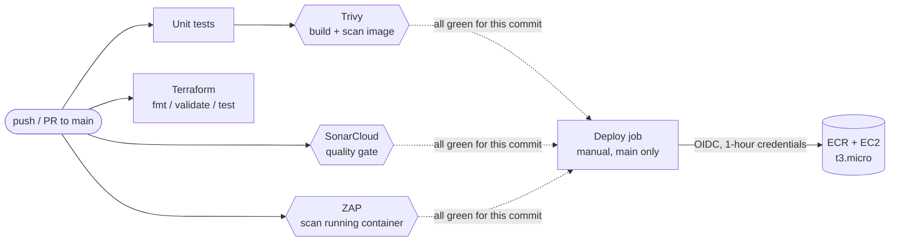
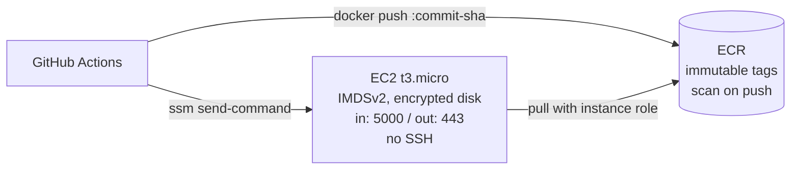

# DevSecOps Pipeline with Full Security Gates

[](https://github.com/Mhdomer/devsecops-pipeline/actions/workflows/phase-1-trivy.yml)
[](https://github.com/Mhdomer/devsecops-pipeline/actions/workflows/phase-2-sonarqube.yml)
[](https://github.com/Mhdomer/devsecops-pipeline/actions/workflows/phase-3-zap.yml)
[](https://github.com/Mhdomer/devsecops-pipeline/actions/workflows/phase-4-deploy.yml)
[](https://sonarcloud.io/summary/new_code?id=Mhdomer_devsecops-pipeline)
[](https://sonarcloud.io/summary/new_code?id=Mhdomer_devsecops-pipeline)

A CI/CD pipeline that **refuses to deploy** unless the code passes three automated security
gates: container scanning (Trivy), static analysis (SonarCloud) and a live dynamic scan
(OWASP ZAP). Infrastructure is Terraform for AWS (EC2 + ECR), deployed through GitHub OIDC
with no stored cloud credentials and no SSH.

The app is a deliberately small Flask JSON API. The project is the pipeline around it.

**Every gate is proven both ways:** a script feeds each one a known-good build (must pass)
and a deliberately broken one (must block). A gate you have never seen fail is not a gate.

---

## The gates

| Gate | Tool | Looks at | Blocks when |
|---|---|---|---|
| Container scan | **Trivy** | Every OS and Python package in the image | Any CRITICAL vulnerability, fixed or not |
| Static analysis | **SonarCloud** | Python, Dockerfile, workflows, shell, Terraform | The "Sonar way" quality gate fails on new code |
| Dynamic scan | **OWASP ZAP** | HTTP responses of the running container | Any High-risk alert, or a mandatory security header is missing |
| Infra checks | **Terraform + Trivy** | `terraform/` | `fmt`/`validate`/`test` fail, or a HIGH/CRITICAL misconfiguration |

What each one can't see is just as important: Trivy doesn't read our code, Sonar doesn't run
it, and ZAP's passive baseline doesn't send attack payloads. Together they cover the parts,
the code and the behaviour.

## Architecture



The deploy job checks through the GitHub API that all three gate workflows passed for the
exact commit before it does anything. Once on AWS it can push one image to one ECR repo and
run one SSM command on one instance. It cannot change infrastructure.



## Security decisions worth knowing

- **Trivy blocks unfixed CVEs too.** The test image on end-of-life Debian 10 had two
  CRITICALs, both "will not fix". With `ignore-unfixed` it would have passed.
- **The Trivy gate had a hidden bug.** With `format: sarif`, `trivy-action` drops the severity
  filter, so the original "block on CRITICAL" step actually blocked on *every* CVE. The fix
  splits enforcing (table, CRITICAL) from reporting (SARIF, all severities).
- **ZAP blocks on policy, not only severity.** ZAP rates missing headers Low or Medium, so a
  "High only" gate never blocks a header-less app. The headers this API promises are listed in
  [`zap/zap-baseline.conf`](zap/zap-baseline.conf) and are mandatory.
- **Supply chain:** every action pinned to a commit SHA, the base image pinned by digest,
  every Python dependency hash-locked and installed as wheels only, Dependabot keeping pins
  current, checkout tokens not persisted.
- **Identity:** GitHub OIDC trust limited to `repo:Mhdomer/devsecops-pipeline:ref:refs/heads/main`.
  No access keys exist anywhere.
- **Runtime:** IMDSv2 required, port 22 closed (shell via SSM Session Manager), HTTPS-only
  egress, immutable image tags, deploy script accepts only a 40-character commit SHA.

All decisions with their alternatives: [docs/engineering-log.md](docs/engineering-log.md#9-decision-record).

## Status

| | |
|---|---|
| Trivy, SonarCloud, ZAP gates | ✅ Pass on `main` and proven to block in CI (draft PRs #1 to #3) |
| Terraform | ✅ `validate`, 9 `terraform test` runs (mocked provider), misconfig scan clean |
| AWS deploy | ⏸ Written and tested offline, waiting for the AWS account to be funded ([runbook](docs/aws-runbook.md)) |
| Single unified pipeline | 🔲 Phase 5 |

Live phase status: [PHASES.md](PHASES.md).

## Run it locally

Needs Docker, Python 3.11+, Trivy and Terraform. On Windows, use Git Bash for the scripts.

```bash
# The app
docker build -t devsecops-demo:local .
docker run --rm -p 5000:5000 devsecops-demo:local
curl -i http://localhost:5000/health

# Unit tests (17)
python -m venv .venv && source .venv/bin/activate      # Windows: .venv\Scripts\activate
pip install --require-hashes --only-binary :all: -r requirements-dev.txt
pytest --cov=app --cov=zap

# Prove each gate passes a good build and blocks a bad one
bash scripts/prove-trivy-gate.sh
bash scripts/prove-zap-gate.sh
SONAR_TOKEN=<token> bash scripts/prove-sonar-gate.sh   # needs a SonarQube server, see the log

# Infrastructure, fully offline
cd terraform && terraform init -backend=false && terraform validate && terraform test
```

Full instructions, including a throwaway local SonarQube: [docs/engineering-log.md § 7](docs/engineering-log.md#7-how-to-run-it).

## Repository layout

```
app/                Flask API + unit tests (security headers on every response)
Dockerfile          Multi-stage, digest-pinned, non-root, no pip at runtime
.github/workflows/  One workflow per gate + Terraform checks and the (disabled) deploy
zap/                ZAP rules (what blocks) and the pass/block decision script
scripts/            Gate runners and the prove-*-gate.sh proofs
tests/gates/        Deliberately broken inputs for the proofs (never used by the real build)
terraform/          EC2 + ECR + OIDC role, with offline tests
docs/               Engineering log, phase plans, AWS runbook, proof output, reviews
```

## Tech stack

Python 3.11 · Flask · gunicorn · Docker · GitHub Actions · Trivy · SonarCloud · OWASP ZAP ·
Terraform · AWS (EC2, ECR, IAM/OIDC, SSM, S3) · pytest · actionlint · zizmor · shellcheck

## Read more

- [Engineering log](docs/engineering-log.md): architecture, every service, how to explain it, dated build history
- [AWS runbook](docs/aws-runbook.md): deploy steps, cost (~$0.05 for a 2-hour demo), teardown
- [Phase plans](docs/): written before the code, one per phase
