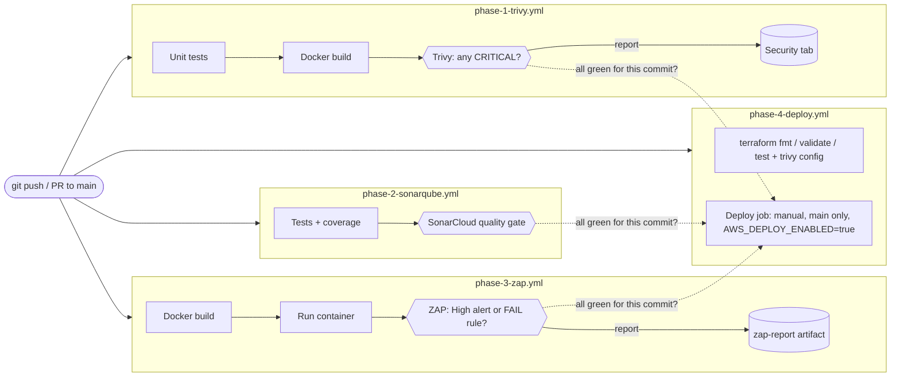
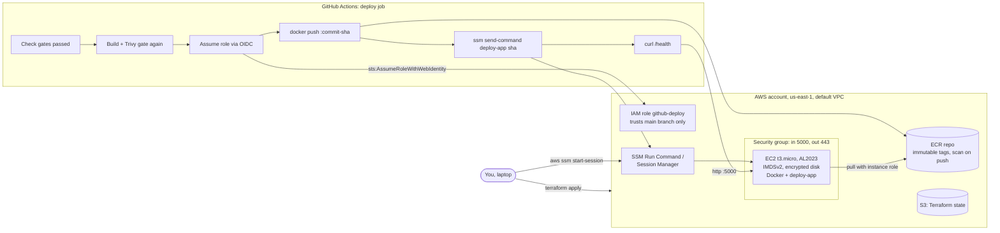
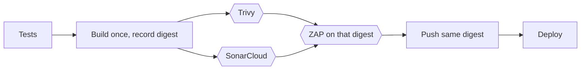

# Engineering Log: DevSecOps Pipeline with Full Security Gates

The one document to read first. It covers what this project is, how to explain it to
different audiences, every service it uses, how the pieces fit, how to run all of it, and a
dated log of what was built, what broke and why each decision was made.

Status on 2026-10-02: security gates 1 to 3 proven locally, Terraform built and tested
offline, nothing pushed yet, nothing deployed to AWS. Live status: [PHASES.md](../PHASES.md).

---

## Contents

1. [What this is](#1-what-this-is)
2. [How to explain it](#2-how-to-explain-it)
3. [Services and tools](#3-services-and-tools)
4. [Architecture](#4-architecture)
5. [How the repo is organised](#5-how-the-repo-is-organised)
6. [The gates in detail](#6-the-gates-in-detail)
7. [How to run it](#7-how-to-run-it)
8. [Engineering log](#8-engineering-log)
9. [Decision record](#9-decision-record)
10. [Known limits and open work](#10-known-limits-and-open-work)
11. [Glossary](#11-glossary)

---

## 1. What this is

A small Flask web API with a GitHub Actions pipeline in front of it. Before any version of
the app can be deployed, it has to pass three automated security checks:

| Gate | Tool | Question it answers |
|---|---|---|
| Container scan | Trivy | Does the packaged app contain software with known critical vulnerabilities? |
| Static analysis (SAST) | SonarQube / SonarCloud | Does the new source code contain security mistakes, like a hardcoded secret? |
| Dynamic scan (DAST) | OWASP ZAP | When the app actually runs, does it respond in an unsafe way? |

If any gate fails, the deploy is blocked. The deploy target is one small EC2 server on AWS,
built with Terraform, reached by GitHub through short-lived credentials (OIDC) and never by
SSH.

The app itself is deliberately trivial (four JSON endpoints). The project is about the
pipeline around it.

What makes it more than a tutorial copy: every gate has a script that proves it works **both
ways**, a clean build passes and a deliberately broken build is blocked. A gate you have
never seen fail is not a gate.

---

## 2. How to explain it

### 2.1 To a non-technical person

**The 30-second version**

> "Before software goes live, it has to pass three security checkpoints, like a bag going
> through an airport. One checks the parts it's built from against a list of known-dangerous
> parts. One reads the code looking for mistakes. One actually runs it and pokes at it like an
> attacker would. If any checkpoint says no, it doesn't go live. And I tested every checkpoint
> by deliberately sneaking a bad bag through to make sure it gets caught."

**The 2-minute version, if they want more**

1. **The problem.** Companies ship software many times a day. Nobody can manually check
   every version for security problems, so problems slip into production.
2. **The idea.** Make the checks automatic and make them able to say *no*. A report that
   nobody reads protects nothing. A checkpoint that stops the line does.
3. **The three checkpoints.**
   - *Parts check (Trivy).* Software is built from hundreds of ready-made parts. Some have
     publicly known security holes. Trivy compares every part against that public list.
     Like checking a car's parts against a manufacturer's recall list.
   - *Proofreading (SonarQube).* A tool reads the code itself and flags dangerous habits,
     like a password written directly into the code. Like a proofreader for security.
   - *Test drive (ZAP).* The app is started and a tool talks to it the way a browser or an
     attacker would, checking whether it gives away information or skips standard
     protections. Like a locksmith testing the doors of a finished house.
4. **Delivery.** Only if all three pass does the software go to the server on Amazon's cloud.
   The server is set up by a written recipe (Terraform), so it can be rebuilt identically
   or torn down in minutes, which also keeps costs near zero.
5. **The part I'm proudest of.** I didn't just set up the checkpoints. I wrote tests that
   push a known-bad version through each one and confirm it gets stopped. While doing that I
   found one checkpoint had been blocking *everything*, safe or not, because of a hidden
   setting.

**Words to avoid with this audience:** CVE, SARIF, OIDC, IMDS, SAST/DAST. Say "known
vulnerability", "security report", "temporary login", "the server", "code check" and
"live test".

### 2.2 To a senior technical person

Lead with the shape, then the trade-offs. They will probe decisions, not tools.

**The one-minute version**

> "Flask app, four GitHub Actions workflows: unit tests and a Trivy image gate, a SonarCloud
> quality gate, and a ZAP baseline DAST gate against the running container. Terraform for a
> t3.micro and an ECR repo, deployed through a GitHub OIDC role that can only push one repo
> and send one SSM command to one instance. No SSH, IMDSv2, immutable tags. Each gate has a
> script that proves it blocks a known-bad input, and the Terraform has `terraform test`
> suites with a mocked provider that I mutation-checked."

**Points worth making, with the reasoning**

| Area | What was done | Why |
|---|---|---|
| Trivy policy | Block on CRITICAL, unfixed included; HIGH reported | `ignore-unfixed` would let an EOL base through (its CRITICALs were all `will_not_fix`). 44 HIGHs today have no upstream fix, so blocking on HIGH would block every build |
| Trivy bug | Separate blocking table step and non-blocking SARIF step | trivy-action unsets `severity` when `format: sarif` unless `limit-severities-for-sarif` is set, so the original gate blocked on any CVE |
| Sonar | `sonar.qualitygate.wait=true`, default "Sonar way" | The scanner exits non-zero on gate failure. Gate conditions are new-code only, so legacy findings don't block |
| ZAP policy | Block on High risk OR on a FAIL-listed rule | Passive baseline rates missing headers Low/Medium. A risk-only threshold would never block the unhardened app. Mandatory headers are policy, not severity |
| ZAP runner | Digest-pinned image via one shell script for CI and local | Same command both places; no extra third-party action |
| Supply chain | Actions pinned to commit SHA, base image to digest, Dependabot for actions/docker/pip, `persist-credentials: false`, zizmor clean | Tags are mutable; SHAs and digests are not. Dependabot keeps pins from rotting |
| Identity | OIDC trust on `sub = repo:Mhdomer/devsecops-pipeline:ref:refs/heads/main`, `aud = sts.amazonaws.com` | No long-lived keys. PRs and other branches cannot assume the role |
| Blast radius | Deploy role: ECR push on one repo ARN, `ssm:SendCommand` on one instance ARN + `AWS-RunShellScript` only. No IAM, no EC2 | A compromised workflow can't change infrastructure. Terraform runs from a human's machine |
| Runtime | IMDSv2 required, hop limit 1, encrypted gp3, SG in 5000 / out 443 only, SSM instead of SSH, deploy script accepts only a 40-hex SHA | Removes SSRF-to-credentials, open admin ports and command injection through the deploy parameter |
| Testing infra | `terraform test` with `mock_provider`, 9 runs; mutation check (IMDSv1, port 22, `ecr:*`) fails the suite | Proves the tests assert security properties, not just that resources exist |
| Cost | Default VPC, no NAT/LB/endpoints, instance type validation allows t3.nano/t3.micro only | ~$0.40/day running, ~$0.05 for a 2-hour demo |

**Questions they are likely to ask, and honest answers**

- *"Is the image you scan the image you deploy?"* Not yet byte for byte. The deploy job
  rebuilds (and `apt-get upgrade` can change it), so it re-runs the Trivy gate on the image it
  pushes. Phase 5 fixes this properly by building once and promoting one digest.
- *"Why not fail on HIGH?"* All current HIGHs are Debian packages with no released fix.
  Failing on them blocks every build with nothing actionable. They're visible in the SARIF
  report and tracked; Dependabot moves the base image when fixes land.
- *"Baseline ZAP is passive. What does it miss?"* Injection, auth flaws, business logic.
  Anything that needs active payloads. The full active scan belongs on a schedule against a
  staging environment, not on every push.
- *"What stops someone bypassing the gates?"* Today, the deploy job checks all three gate
  workflows passed for that exact commit. Next: branch protection with the gates as required
  checks, and Phase 5's single pipeline with `needs:`.
- *"Why SSM Run Command and not SSH or CodeDeploy?"* No inbound port, no key management,
  every command is logged in AWS, and it's free. CodeDeploy adds an agent and an app config
  for a single container.
- *"What would you add with another week?"* Build-once promotion, SBOM + image signing
  (Syft/Cosign) with signature verification on the instance, authenticated ZAP scan, and
  Checkov alongside `trivy config`.

---

## 3. Services and tools

### Cloud and hosted services

| Service | Used for | Where configured | Cost |
|---|---|---|---|
| **GitHub** (repo) | Source, public | - | Free |
| **GitHub Actions** | Runs the four workflows | `.github/workflows/` | Free (public repo) |
| **GitHub Security tab** | Shows Trivy SARIF findings | `phase-1-trivy.yml` upload step | Free |
| **GitHub Dependabot** | PRs to bump actions, base image, pip deps | `.github/dependabot.yml` | Free |
| **GitHub OIDC token issuer** | Signs a token per workflow run that AWS trusts | `terraform/iam.tf` | Free |
| **SonarCloud** | Hosted SAST + quality gate | `sonarqube/sonar-project.properties` | Free (public repo) |
| **Docker Hub** | `python:3.11-slim-trixie` base image | `Dockerfile` (digest-pinned) | Free |
| **GitHub Container Registry** | `zaproxy/zaproxy:stable` image | `scripts/zap-scan.sh` (digest-pinned) | Free |
| **AWS ECR** | Private registry for the deployed image | `terraform/ecr.tf` | ~$0.10/GB-month |
| **AWS EC2** | One t3.micro running the container | `terraform/ec2.tf` | ~$0.25/day |
| **AWS VPC (default)** | Network; security group as firewall | `terraform/security_group.tf` | Free; public IPv4 ~$0.12/day |
| **AWS IAM** | EC2 role, GitHub OIDC provider, deploy role | `terraform/iam.tf` | Free |
| **AWS Systems Manager** | Session Manager (shell), Run Command (deploy), Parameter Store (latest AMI ID) | `terraform/ec2.tf`, `iam.tf` | Free |
| **AWS S3** | Terraform state, lockfile locking | `terraform/main.tf`, runbook step 2 | ~$0 |

AWS rows are **not created yet**. See [aws-runbook.md](aws-runbook.md).

### Tools

| Tool | Version | Role |
|---|---|---|
| Python / Flask / gunicorn | 3.11 / 3.1.3 / 26.2.0 | App and its production server |
| pytest / pytest-cov | 9.1.1 / 7.1.0 | Unit tests, coverage for Sonar |
| Docker | 29.x | Build, run, and run every scanner in a container |
| Trivy | 0.72.0 | Image vulnerability gate, Terraform misconfiguration scan |
| SonarQube Community | 26.9 (local container) | Local stand-in for SonarCloud when proving the gate |
| sonar-scanner-cli | container | Sends analysis to SonarQube/SonarCloud |
| OWASP ZAP | `stable`, digest-pinned | Baseline DAST scan |
| Terraform | 1.15.8, AWS provider ~> 6.67 | Infrastructure as code, `terraform test` |
| actionlint | container | Workflow syntax and shell lint |
| zizmor | pip, in `.venv` | Workflow security audit |
| shellcheck | container | Shell script lint |

---

## 4. Architecture

### 4.1 Pipeline today (four workflows, run in parallel on every push and PR)



The deploy job runs only when started by hand from `main` with the repo variable
`AWS_DEPLOY_ENABLED=true`. Its first step asks the GitHub API whether all three gate
workflows passed for the same commit, and refuses otherwise.

### 4.2 Deploy path and AWS runtime (written, not applied)



Things to notice: there is no inbound SSH anywhere; CI never runs Terraform; the instance
pulls the image with its own role, so no credentials live on the box.

### 4.3 Target for Phase 5 (not built)



One workflow, gates ordered with `needs:`, and the exact image that was scanned is the one
deployed.

### 4.4 What each gate can and cannot see

| | Trivy | SonarQube | ZAP baseline |
|---|---|---|---|
| Looks at | Package lists inside the image | Source code | HTTP responses of the running app |
| Catches | Known CVEs in OS and Python packages | Hardcoded secrets, debug mode, unsafe patterns | Missing security headers, info leaks, cookie flags |
| Misses | Bugs in our own code, zero-days | Runtime config, dependency CVEs | Anything needing active attack payloads or login |

Together they cover the parts, the code and the behaviour. None covers business logic.

---

## 5. How the repo is organised

```
.
├── app/                        The Flask API (the thing being protected)
│   ├── app.py                  4 routes + security headers on every response
│   ├── requirements.txt        Pinned runtime deps
│   └── tests/test_app.py       Unit tests incl. header tests (pytest)
├── Dockerfile                  Multi-stage, digest-pinned base, non-root, no pip at runtime
├── .dockerignore               Keeps tests, venv, docs out of the image
│
├── .github/
│   ├── workflows/
│   │   ├── phase-1-trivy.yml   Tests → build → Trivy gate → SARIF → summary
│   │   ├── phase-2-sonarqube.yml  Tests+coverage → SonarCloud gate → summary
│   │   ├── phase-3-zap.yml     Build → run → ZAP gate → report artifact → summary
│   │   └── phase-4-deploy.yml  Terraform checks; deploy job (disabled)
│   └── dependabot.yml          Weekly bumps: actions, base image, pip
│
├── sonarqube/sonar-project.properties   SonarCloud project key, paths, coverage
├── zap/
│   ├── zap-baseline.conf       Which ZAP rules FAIL (block) vs WARN
│   └── zap_gate.py             Pass/block decision from ZAP's JSON report
├── scripts/
│   ├── trivy-local.sh          Quick pre-push Trivy check (same policy as CI)
│   ├── zap-scan.sh             ZAP scan + gate; used by CI and locally
│   ├── prove-trivy-gate.sh     Proof: real image passes, vulnerable image blocks
│   ├── prove-sonar-gate.sh     Proof: clean code passes, planted findings block
│   └── prove-zap-gate.sh       Proof: hardened app passes, headers-removed app blocks
├── tests/gates/                Known-bad inputs for the proofs + gate unit tests
│   ├── Dockerfile.vulnerable   EOL Debian 10 + old deps (never deploy)
│   ├── sonar-planted-issue.patch  Hardcoded secret, DEBUG=True, password
│   ├── zap-remove-headers.patch   Disables the security-header hook
│   └── test_zap_gate.py        Unit tests for zap_gate.py
│
├── terraform/
│   ├── main.tf                 Provider, S3 backend, default tags
│   ├── variables.tf            Region, repo, instance type guardrail, ingress CIDRs
│   ├── ecr.tf  ec2.tf  iam.tf  security_group.tf  outputs.tf
│   ├── templates/user_data.sh.tftpl   Boot script: Docker + deploy-app
│   ├── tests/infra.tftest.hcl  9 offline tests with a mocked AWS provider
│   └── backend.hcl.example     Copy to backend.hcl (gitignored) before real init
│
├── docs/
│   ├── engineering-log.md      This file
│   ├── phase-1..5-*.md         Plan per phase, written before the code, + status
│   ├── aws-runbook.md          Exact AWS steps, cost, teardown (PENDING funding)
│   ├── evidence/               Saved output of the three proof scripts
│   └── reviews/                Session reviews
├── PHASES.md                   Phase status table + overall success criteria
├── LEARNING.md                 Personal session journal
└── learning/                   Checkpoint questions per phase
```

Config files at the root: `pytest.ini` (test paths), `.coveragerc` (coverage scope),
`requirements-dev.txt` (test deps), `.gitattributes` (LF endings for scripts and templates),
`docker-compose.yml` (optional local run).

**Naming rule used throughout:** anything deliberately broken lives under `tests/gates/` and
says so in its first line. Nothing there is used by the real build.

---

## 6. The gates in detail

### 6.1 Trivy (container scan)

- **Policy:** block on any CRITICAL vulnerability in the image, including ones with no fix.
  HIGH and below are reported, not blocking.
- **Where:** `phase-1-trivy.yml` step "Trivy image scan (BLOCKING on CRITICAL)".
- **Reports:** full SARIF (all severities) to the GitHub Security tab and as an artifact.
- **Image hardening that keeps it green:** digest-pinned `python:3.11-slim-trixie`,
  `apt-get upgrade` in the final stage, pip/setuptools/wheel removed, non-root user.
- **Current result:** 0 CRITICAL, 44 HIGH (all without an upstream fix).
- **Proof:** `scripts/prove-trivy-gate.sh` builds the real image (exit 0) and
  `tests/gates/Dockerfile.vulnerable` on Debian 10 (exit 1, CVE-2019-8457, CVE-2023-45853).

### 6.2 SonarQube / SonarCloud (static analysis)

- **Policy:** SonarCloud's default "Sonar way" quality gate. On new code: 0 new issues, ≥80%
  coverage, ≤3% duplication, all security hotspots reviewed.
- **Where:** `phase-2-sonarqube.yml`, `sonarqube-scan-action` with
  `-Dsonar.qualitygate.wait=true`, so the scanner exits non-zero when the gate fails.
- **Coverage:** pytest-cov writes `coverage.xml`; the app is at 100%.
- **Proof:** `scripts/prove-sonar-gate.sh` runs coverage and the scanner in containers.
  Clean source: exit 0. With `tests/gates/sonar-planted-issue.patch`: exit 3, failing
  condition `new_violations = 2` (S2068 hardcoded credential, S4507 debug enabled).
  Proven on a local SonarQube 26.9 container; works against SonarCloud with
  `SONAR_HOST_URL=https://sonarcloud.io`.

### 6.3 OWASP ZAP (dynamic scan)

- **Policy:** block if ZAP raises any **High** risk alert, or any alert from a rule set to
  `FAIL` in `zap/zap-baseline.conf`. The FAIL list is the headers the app promises
  (CSP, X-Content-Type-Options, anti-clickjacking, Permissions-Policy, CORP, CSP
  directives without fallback) plus server version leaks.
- **Where:** `phase-3-zap.yml` runs `scripts/zap-scan.sh`, which runs the digest-pinned ZAP
  container and then `zap/zap_gate.py`.
- **The app's side:** `SECURITY_HEADERS` in `app/app.py`, applied to every response by an
  `after_request` hook, tested in `test_security_headers_on_every_response`.
- **Proof:** `scripts/prove-zap-gate.sh`. Hardened app: exit 0. App built with
  `tests/gates/zap-remove-headers.patch`: exit 1 (rules 10021, 10038, 10063, 90004).
- **Gate logic tests:** `tests/gates/test_zap_gate.py` (6 tests, incl. "High blocks even when
  not on the FAIL list" and "missing report is an error, not a pass").

### 6.4 Infrastructure checks (Phase 4, every push)

`terraform fmt`, `validate`, `terraform test` (mocked provider, no AWS), and `trivy config` on
`terraform/` blocking on HIGH/CRITICAL. One finding is accepted with an inline ignore:
HTTPS egress to `0.0.0.0/0` (AWS-0104), because narrowing it needs paid VPC endpoints.

---

## 7. How to run it

### 7.1 Prerequisites

| Tool | Check |
|---|---|
| Docker Desktop, running | `docker version` shows a Server section |
| Python 3.11+ | `python --version` |
| Trivy 0.72 | `trivy --version` |
| Terraform 1.15 | `terraform version` |
| GitHub CLI, logged in | `gh auth status` |
| Bash | Git Bash on Windows. Scripts handle Windows paths themselves |

All commands run from the repo root unless they `cd`.

### 7.2 Run the app

```bash
docker build -t devsecops-demo:local .
docker run --rm -p 5000:5000 devsecops-demo:local
curl -i http://localhost:5000/health      # 200 {"status":"healthy"} + security headers
```
Other endpoints: `GET /`, `GET /api/items`, `POST /api/items` with `{"name": "..."}`.

### 7.3 Unit tests

```bash
python -m venv .venv
.venv/Scripts/python -m pip install -r requirements-dev.txt     # Linux/macOS: .venv/bin/python
.venv/Scripts/python -m pytest --cov=app --cov=zap              # 16 tests
```

### 7.4 Trivy

```bash
bash scripts/trivy-local.sh          # quick pre-push check, same policy as CI
bash scripts/prove-trivy-gate.sh     # proof both ways; prints PROVEN or NOT PROVEN
```

### 7.5 SonarQube (local server, no account needed)

```bash
docker network create b2-net
docker run -d --name b2-sonar --network b2-net -p 9000:9000 \
  -e SONAR_ES_BOOTSTRAP_CHECKS_DISABLE=true sonarqube:community
# wait ~1-2 min, open http://localhost:9000, log in admin/admin, set a new password
# create project key Mhdomer_devsecops-pipeline, generate a token
# Project Settings > New Code > "Number of days" = 30 (so local changes count as new code)
SONAR_TOKEN=<token> bash scripts/prove-sonar-gate.sh
```
Against SonarCloud instead:
`SONAR_HOST_URL=https://sonarcloud.io SONAR_TOKEN=<token> NETWORK=bridge bash scripts/prove-sonar-gate.sh`

Clean up: `docker rm -f b2-sonar && docker network rm b2-net`

### 7.6 ZAP

```bash
bash scripts/prove-zap-gate.sh       # builds both images, scans both, cleans up after itself
```
Reports land in `zap-out/good/` and `zap-out/bad/` (`zap-report.html` opens in a browser).

### 7.7 Terraform (offline)

```bash
cd terraform
terraform init -backend=false
terraform fmt -check -recursive
terraform validate
terraform test                       # 9 passed
trivy config --severity HIGH,CRITICAL .
```
Never run `plan` or `apply` until the AWS account is funded. Then follow the runbook.

### 7.8 Lint the pipeline itself

```bash
docker run --rm -v "$(pwd -W 2>/dev/null || pwd):/repo" -w /repo rhysd/actionlint:latest
.venv/Scripts/python -m pip install zizmor && .venv/Scripts/zizmor --offline .github/workflows
docker run --rm -v "$(pwd -W 2>/dev/null || pwd):/mnt" -w /mnt koalaman/shellcheck:stable scripts/*.sh
```
(On Git Bash prefix the docker lines with `MSYS_NO_PATHCONV=1`.)

### 7.9 In CI

Push to `main` or open a PR. Four workflows start. Where to look:

| What | Where |
|---|---|
| Pass/block per gate | Actions tab > run > Summary (each workflow writes a gate table) |
| Trivy findings | Security tab > Code scanning |
| SonarCloud results | sonarcloud.io project dashboard |
| ZAP report | Run > Artifacts > `zap-report` |

Needs the `SONAR_TOKEN` secret first, or the Sonar workflow fails on purpose with a message
saying so.

### 7.10 Deploy to AWS

Not yet. [aws-runbook.md](aws-runbook.md) has the full sequence: budget alarm, pre-checks,
state bucket, `terraform apply`, GitHub variables, first deploy, verification, teardown.

---

## 8. Engineering log

Newest at the bottom. Each entry: what happened, why, and what it taught.

### 2026-05-08: Project set up
- Structure, five phase plans written before any code, learning journal and checkpoints.
- Flask app with 3 routes and 5 tests. Multi-stage Dockerfile, non-root user.

### 2026-05-14: Phase 1 workflow (Trivy)
- Tests → build → Trivy image scan with `exit-code: 1` → summary job.
- Image scan used `format: sarif` so results reach the Security tab.

### 2026-05-15: Phase 2 workflow (SonarCloud)
- Coverage job + `SonarSource/sonarcloud-github-action@master` with `qualitygate.wait`.
- SonarCloud account and token marked as manual steps, not done.

### 2026-05-16: Both CI runs fail
- Trivy job failed at the blocking scan. Sonar job failed at the scan step.
- Left uninvestigated until October. By then the logs had expired (HTTP 410), so diagnosis
  had to come from job/step metadata and annotations.

### 2026-10-01: Diagnosis
- **Sonar:** annotation "Running this GitHub Action without SONAR_TOKEN"; `gh secret list`
  empty. Plus a deprecation warning for the action.
- **Trivy:** the deps scan showed 0 CRITICAL, and the current base image showed 0 CRITICAL,
  yet the gate had blocked. Reading trivy-action's `entrypoint.sh` found the cause: in SARIF
  mode it unsets `TRIVY_SEVERITY` unless `limit-severities-for-sarif` is true. The gate was
  blocking on every CVE of every severity.
- **Also:** all actions on Node 20, removed from runners 2026-09-16.
- *Lesson:* read what an action actually does with its inputs. The YAML said CRITICAL; the
  behaviour was "anything".

### 2026-10-01: Phase 1 fixed and proven
- Deps bumped (gunicorn and werkzeug had HIGH CVEs). Base image pinned by digest,
  `apt-get upgrade`, pip/setuptools/wheel removed: 53 HIGH (51 OS + 2 Python) → 44 HIGH, 0 CRITICAL.
- First "vulnerable image blocks" attempt exited 1, but because the **build** failed (Flask
  3.1 needs Python ≥3.9). That would have been a fake proof. Fixture changed to old deps;
  proof scripts now abort on build errors.
- The real bad image (Debian 10) had only 2 CRITICALs, both `will_not_fix`, and Trivy warned
  detection is limited on EOL distros. Decided: unfixed CVEs still block.
- *Lesson:* a "block" only counts if you know *why* it blocked.

### 2026-10-01: Workflows rebuilt
- Trivy: blocking table step + non-blocking SARIF step. Sonar: `sonarqube-scan-action` v8.3.0,
  settings from the properties file, explicit "secret missing" error, fork PRs skipped.
- All actions bumped to Node 24 majors and pinned to SHAs. Dependabot added. actionlint clean.

### 2026-10-01: Phase 2 proven on a local SonarQube
- No SonarCloud token available, so a SonarQube 26.9 container stood in, same scanner and
  settings. Clean: exit 0. Planted secret + debug: exit 3.
- Snag: the default gate only judges new code, and a fresh project has none. Set the new-code
  period to 30 days so the planted lines counted.
- Snag: reverse-applying the planted patch failed on CRLF line endings. Script now restores
  the file from a backup.
- Snag: exit code capture via `PIPESTATUS` after `|| true` could report success for a failed
  scan. Rewritten.
- The scan also showed old findings (route methods, binding 0.0.0.0, CSRF). Fixed the first
  two; CSRF left as not applicable (stateless JSON API).

### 2026-10-02: Phase 3 (ZAP) built and proven
- Baseline scan of the bare app: 5 warnings, worst one Medium (no CSP). A High-only gate would
  never block it, so the gate became "High OR FAIL-listed rule".
- Security headers added test-first. Next scan flagged rule 10055: `base-uri` and
  `form-action` don't fall back to `default-src`. Added both.
- ZAP runs from its container through one script for CI and local.
- Proof: hardened exit 0, headers removed exit 1.

### 2026-10-02: Pipeline security audit
- zizmor found `actions/checkout` persisting the token in every job and two `${{ env }}`
  expansions inside shell. Fixed both; zizmor clean.

### 2026-10-02: Phase 4 Terraform (offline)
- EC2 + ECR + OIDC role, with decisions that differ from the original plan: OIDC instead of
  access keys, no SSH, CI never runs Terraform, immutable SHA tags.
- `terraform test` with a mocked AWS provider, 9 runs. All passed first time, which was
  suspicious, so three regressions were planted (IMDSv1, port 22, `ecr:*`). All three failed
  the suite. Restored.
- `trivy config`: one CRITICAL on HTTPS egress, accepted with a documented ignore.
- Found the `user_data` template wasn't covered by `.gitattributes`; a Windows checkout would
  have broken the boot script with CRLF. Fixed and verified by rendering and shellchecking it.
- Deploy job written but disabled behind a repo variable. Runbook written, marked PENDING.

### 2026-10-02 (later): SonarCloud project created, pre-push hardening
- Mohamed imported the repo into SonarCloud. Its Automatic Analysis ran on the **old** May
  code on GitHub (`33aba7e`): Security E, 14 issues. 6 were already fixed locally.
- Found that GitHub's May commits differ from the local ones only by AI co-author trailers
  (same content). A plain push will be rejected; it needs `--force-with-lease`.
- The rest would have failed the first CI quality gate, because every line changed since
  that baseline counts as new code and "Sonar way" allows zero new issues:
  - pip installs without hash-locked versions or `--only-binary` (S8544, S8541). Fixed:
    `pip-compile --generate-hashes`, every install uses `--require-hashes --only-binary :all:`.
  - `[` instead of `[[` in scripts (S7688).
- Pulled SonarCloud's active GitHub Actions and shell rules (local SonarQube has neither
  analyser) and fixed what would fire: `chmod 777` for ZAP's output (now a uid-owned tar
  copied into the container), an image artifact loaded without verification (build and scan
  now share a job), workflow-level permissions (now per job), errors to stdout, implicit
  function returns.
- Widened the CI scan from `app/` to the whole repo, with three accepted findings written
  into `sonar-project.properties` with their reasons.
- actionlint caught that `:all: ` breaks a plain YAML scalar; both install steps would have
  failed to parse in CI.
- Re-proven: all three gates both ways; local SonarQube shows 0 open issues repo-wide.
- *Lesson:* the first analysis on a hosted scanner is a different ruleset from the local one.
  Pull its active rules and check them before the first push, not after a red run.

### Next entries expected
- First push: CI results for all four workflows.
- SonarCloud setup and first quality gate in CI.
- Phase 5: single pipeline, build once.
- AWS funded: first real deploy and teardown.

---

## 9. Decision record

Short form. Full reasoning in [reviews/2026-10-02.md](reviews/2026-10-02.md), section 4.

| # | Decision | Alternative rejected | Reason |
|---|---|---|---|
| D1 | Trivy blocks CRITICAL incl. unfixed | `ignore-unfixed`, or block HIGH | EOL images are mostly unfixed; HIGH is all unfixable noise today |
| D2 | Base image pinned by digest + Dependabot | Floating tag | Reproducible scans; updates arrive as reviewable PRs |
| D3 | `apt-get upgrade` + strip pip in final image | Leave base as-is | Removes 9 fixable HIGHs |
| D4 | ZAP: High OR FAIL-listed rule | High-only | High-only never blocks a header-less app |
| D5 | ZAP via pinned container + script | `zaproxy/action-baseline` | Same command locally and in CI |
| D6 | OIDC deploy role | IAM user access keys | Nothing long-lived to leak |
| D7 | Terraform applied by a human only | Terraform in CI | Keeps the CI role unable to touch IAM/EC2 |
| D8 | SSM, no SSH | SSH from your IP | No open admin port, no keys, audited |
| D9 | Deploy by commit SHA into immutable ECR | `:latest` | A scanned tag can never be overwritten |
| D10 | No phase ✅ until CI proves it | Mark ✅ after local proof | Local proof isn't the claim being made |
| D11 | Deploy job gated by manual run + `main` + repo variable + gate check | Auto-deploy on push | No AWS cost until funded; can't skip gates |
| D12 | Default VPC, no NAT/LB/endpoints | Custom VPC with private subnets | ~$40+/month saved for a demo |

---

## 10. Known limits and open work

| Limit | Impact | Plan |
|---|---|---|
| Nothing proven in CI yet | Claims are local-only | Push after SonarCloud setup |
| Scanned image ≠ deployed image (rebuild) | Small drift risk; Trivy re-runs, ZAP/Sonar don't | Phase 5: build once, promote digest |
| Four parallel workflows | No ordering between gates | Phase 5: one workflow with `needs:`; branch protection |
| ZAP is passive and unauthenticated | Misses injection, auth, logic flaws | Scheduled active scan against staging |
| 44 unfixable HIGH CVEs | Visible risk accepted | Dependabot on base image; consider distroless later |
| No SBOM or image signing | Can't prove provenance on the instance | Syft + Cosign, verify before `docker run` |
| Sonar CSRF finding open | Not applicable to this API | Mark "Safe" in SonarCloud with the reason |
| Port 5000 public, plain HTTP | Fine for a demo with no data | Restrict CIDR or add TLS if it ever holds data |

---

## 11. Glossary

| Term | Plain meaning |
|---|---|
| **Gate** | An automated check that can stop the pipeline, not just report |
| **CVE** | A publicly listed, numbered security vulnerability in some software |
| **Container / image** | The app packaged with everything it needs to run; the image is the package, the container is it running |
| **SAST** | Static Application Security Testing: checking source code without running it |
| **DAST** | Dynamic Application Security Testing: checking the running app from outside |
| **SARIF** | A standard file format for security findings that GitHub can display |
| **Quality gate** | Sonar's pass/fail rule set for an analysis |
| **Security headers** | Instructions the app sends to browsers, e.g. "don't let other sites frame me" |
| **Terraform** | Tool that creates cloud infrastructure from text files |
| **OIDC** | A way for GitHub to prove to AWS who it is with a signed, short-lived token instead of a stored password |
| **IAM role** | A set of AWS permissions something can temporarily take on |
| **ECR** | AWS's private storage for container images |
| **EC2** | A virtual server on AWS |
| **SSM** | AWS Systems Manager: run commands on or open a shell to a server without SSH |
| **IMDSv2** | Safer version of the service that hands a server its AWS credentials |
| **Digest / SHA pin** | Referring to an exact version by its content hash, so it can't change underneath you |
| **Mutation check** | Breaking the code on purpose to confirm the tests notice |
